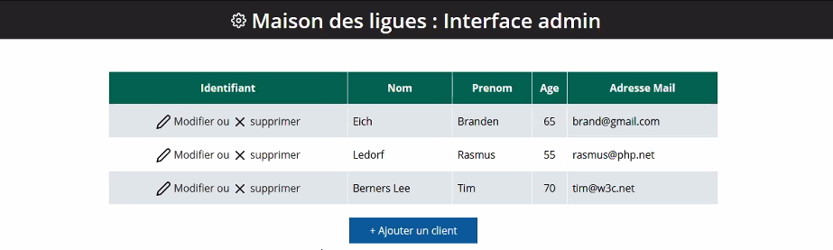

# Réaliser une interface admin gestion clients

- Cette partie de site admin a pour but de permettre aux administrateurs des
  Maisons des ligues, de recenser leurs clients. Pour ce faire, il faut créer une
  interface admin qui permet d’ajouter un client, modifier sont profile ou le
  supprimer.

### Landing page : 

### Page pour ajouter le client :

### Page pour modifier et supprimer le client :

**Voici enfin la base de données contenant les informations des clients :**

Aspect technique 

1. Les technologies autorisées sont : html5 css3 et php orienté objet
2. Police de caractères : ‘Open Sans’, sans-serif
3. Iconographies obligatoires 
Couleur des boutons : #09599A(blue), #00614E(vert) et #d63031(rouge)
La couleur des thèmes doivent être indexée dans des variables css
4. Utilisez Visual Studio Code et phpMyAdmin pour la bdd.
Le code HTML généré doit être valide selon les normes du W3C et tester 
également pour les spécificités de la WAI et du WCAG (accessibilité)